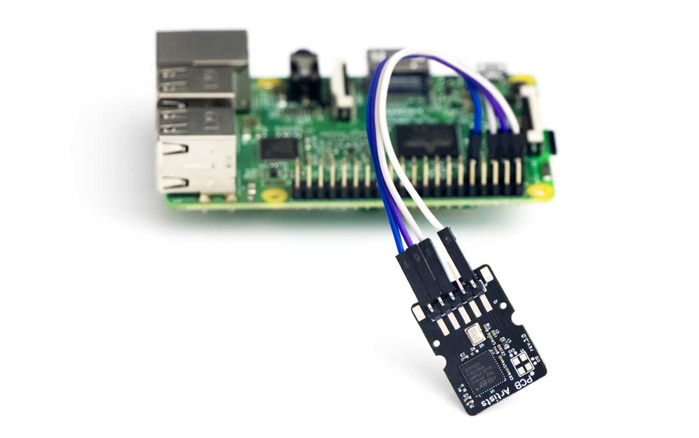
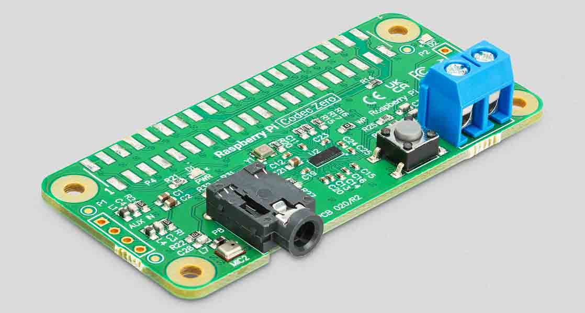
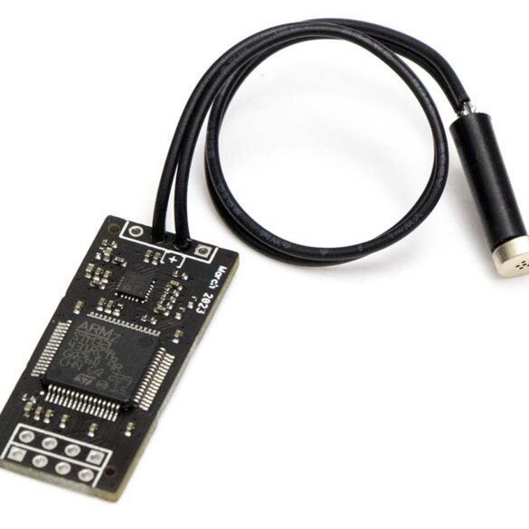
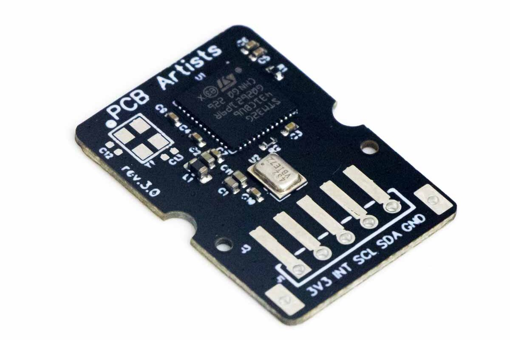
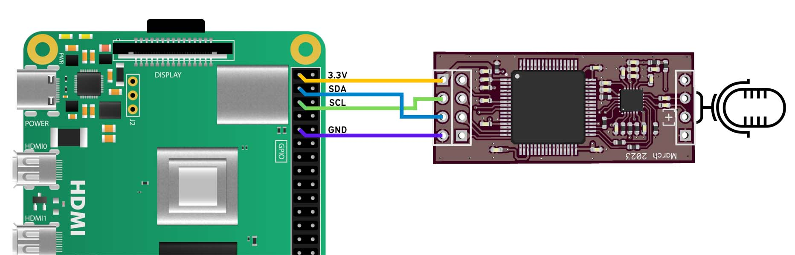
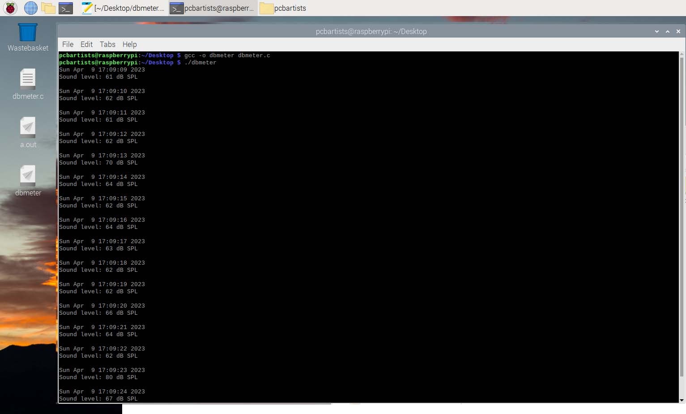

# Accurate Raspberry Pi Decibel Meter

*Guide to measuring sound level in decibels using the PCB Artists Decibel Meter
Module with a Raspberry Pi.*

## Overview

How easily can you make a Raspberry pi sound level meter that measures sound
level in decibels? This article will walk you through the process of interfacing
our I2C sound level sensor module and making an accurate Raspberry Pi decibel
meter using a few lines of C code to read sound levels in dB SPL.



## Two ways to make a Raspberry Pi dB Meter

A more direct method, although not very efficient, would be to get a sound card
or a Raspberry Pi HAT with microphones and an audio codec on it. The Raspberry
Pi will then record the audio coming in from the HAT and perform the required
steps of converting the audio into frequency domain and applying weighting
filters to arrive at a final decibel value for the sound input.

### The inefficient approach - using audio HAT or microphone input

Audio codec HATs for the Raspberry Pi are quite common and you can pick one to
act as a sound card for your R-Pi.
[Yuri’s noise level dashboard project on Medium](https://medium.com/homeday/building-a-noise-level-dashboard-for-your-office-with-a-raspberry-pi-71360ee1ff46)
does exactly that.
[Codec Zero](https://www.raspberrypi.com/products/codec-zero/) is yet another
popular audio HAT for Raspberry Pi. However, the problem of using this approach
become clear pretty quickly.

- The **Raspberry Pi 3B CPU runs at almost 20-30%**, just crunching numbers to
extract a decibel value.

- Just based on the CPU usage pattern, power consumption will be very high. The
  codec boards consume little power, but the CPU tends to run hot.
- **Raspberry Pi cannot be put to sleep between measurements** if it is
  responsible for the measurement and processing itself – sound level triggered
  wake-up is not possible.
- A **codec or audio hat can take up several GPIOs** on the Raspberry Pi header
  that cannot be used elsewhere.
- Difficult to **calibrate, connect and use HATs** because they can be bulky and
  off-the-shelf. The microphones they use may not be optimal for measurement
  purposes either.



### The efficient approach - using a sound level measurement module

To **solve all the above problems** that would make most Raspberry Pi sound
level monitooring applications impractical, the alternate approach would be to
**use a dedicated module for sound level monitoring** and measurement in
decibels. The PCB Artists module does just that and provides unique features
that can make your Raspberry Pi decibel meter application extremely easy to set
up.





The
[PCB Artists decibel sound level meter module](https://pcbartists.com/product/i2c-decibel-sound-level-meter-module/) contains a dedicated ARM Cortex M4 MCU
with hardware to accelerate and efficiently perform mic response compensation,
filtering, frequency analysis, weighting and averaging operations on an input
audio stream. This offloads the Raspberry Pi completely and all it has to do is
fetch the latest decibel values from the decibel meter module using I2C
interface.

- **0% CPU use** because the Raspberry Pi does not need to perform any
processing. The module will even store 100 most recent samples!

- **Raspberry Pi can sleep and be woken up** when audio level crosses certain
  low and high thresholds.
- The decibel meter module **only consumes 5mA at 3.3V** when running
  continuously.
- You only need to **connect I2C SCL and SDA pins** to use the module. The
  interrupt output of the module may be used if required.
- You can obtain **accurate and repeatable** sound level values and **easily
  locate the microphone anywhere**.

## Connect decibel sensor with Raspberry Pi

Connecting Raspberry Pi and the PCB Artists decibel level sensor is very easy.
All it needs to work is a 3.3V power supply, GND and I2C signal lines. Other
features of the module such as the interrupt pin may be left unconnected when
not needed.



If you follow the connection diagram shown above, the **decibel sensor is now
connected to I2C1 of the Raspberry Pi**.

## Testing the sound level sensor

Testing the sound level sensor is easy. Once you have connected the module to a
Raspberry Pi, you can follow these steps to ensure that the module is
functional.

- Make sure that I2C interface is enabled in the Linux image that you are
running on your  Raspberry Pi, especially if this is a fresh installation. You
can enable
[I2C interface by following this article](https://www.raspberrypi-spy.co.uk/2014/11/enabling-the-i2c-interface-on-the-raspberry-pi/).
- Once I2C is enabled, keep following the above article until the end, run
  `i2cdetect -y 1`. If the decibel sensor is properly connected, you should see
  address `0x48` highlighted.
- Make sure I2C tools are installed.

    ```
    > sudo apt-get install -y i2c-tools
    ```

- You can simply fetch the decibel sound level reading by fetching register
  `0x0A` of the module using command

  ```
  > sudo i2cget 1 0x48 0x0A
  ```

- The decibel value read from `0x0A` after module power-up is the A-weighted and
  1 second averaged sound level reading in db SPL. You can change these settings
  in the sound level module.

## C code for reading sound level in decibels

The example decibel meter C code provided here serves as a simple example and
demonstration to show how easy it is to fetch noise level values from the PCB
Artists sound level meter module.

The code shared below simply opens `I2C1` port, connects to the sensor over I2C
address `0x48` and then fetches the decibel reading from address `0x0A`.

The default settings can be changed by writing to the configuration registers of
the decibel meter module. On power-up, default weighting is A-weighted and
averaging time is 1 second (or slow mode, as sound meters call it).

These default settings provide optimal performance in most indoor and outdoor
settings.

```c
#include <stdio.h>
#include <stdlib.h>
#include <time.h>
#include <fcntl.h>
#include <unistd.h>
#include <linux/i2c-dev.h>
#include <sys/ioctl.h>

int main()
{
 int file;
 char data;
 time_t rawtime;
 struct tm *timeinfo;
 
 // Open I2C1 for reading the sound meter module registers
 if ((file = open("/dev/i2c-1", O_RDWR)) < 0)
 {
  perror("Failed to open I2C1!");
  exit(1);
 }
 
 // 0x48 is the decibel meter I2C address
 if (ioctl  (file, I2C_SLAVE, 0x48) < 0)
 {
  perror ("db Meter module is not connected/recognized at I2C addr = 0x48");
  close (file);
  exit (1);
 }
  
 while (1)
 {
  // Decibel value is stored in register 0x0A
  data = 0x0A;
  if (write (file, &data, 1) != 1)
  {
   perror ("Failed to write register 0x0A");
   close (file);
   exit (1);
  }
   
  if (read (file, &data, 1) != 1)
  {
   perror ("Failed to read register 0x0A");
   close (file);
   exit (1);
  }
   
  time (&rawtime);
  timeinfo = localtime (&rawtime);
   
  printf ("%sSound level: %d dB SPL\r\n\r\n", asctime(timeinfo), data);
  sleep (1);
 }
 
 close (file);
 return 0;
}
```

### Building the decibel meter C code

You can build and run the C code on any Raspberry Pi board using the
[default official Raspberry Pi OS image](https://www.raspberrypi.com/software/).

- Copy the C code over to the Desktop or any location of your choice. I named
  the C file as dbmeter.c
- Open the command terminal and go over to the C file’s location.

    ```bash
    > cd Desktop
    ```

- Build the C code using the native GCC compiler on Raspberry Pi OS. The
  resulting executable file is to be named dbmeter.

    ```bash
    Desktop > gcc -o dbmeter dbmeter.c
    ```

- If everything compiles correctly and no errors are found, dbmeter will be
  generated and you can execute it.

    ```bash
    Desktop > ./dbmeter
    ```

If the Raspberry Pi decibel meter module is correctly connected to I2C1, you
should see the decibel value and timestamp printed out every second.



You can use the module in several applications such as indoor home or office
noise monitoring or outdoors for crowd or traffic detection. The interrupt based
wakeup feature can help wake the Raspberry Pi up when the measured sound level
falls below or goes over set threshold values. This enables Raspberry Pi to be
used in **low power battery operated** sound level monitoring applications as
well.

## Buy the Decibel Sound Sensor Module

The sound sensor module is available to buy on our web store. You can find more
information and example project links on the product page. We ship worldwide.

If you need something customized, please feel free to
[get in touch](https://pcbartists.com/contact/).

[I2C Decibel Sound Sensor Module (product page)](https://pcbartists.com/product/i2c-decibel-sound-level-meter-module/)

## Change Log

17 April 2023

- Initial release

6 May 2023

- Update product link and images
