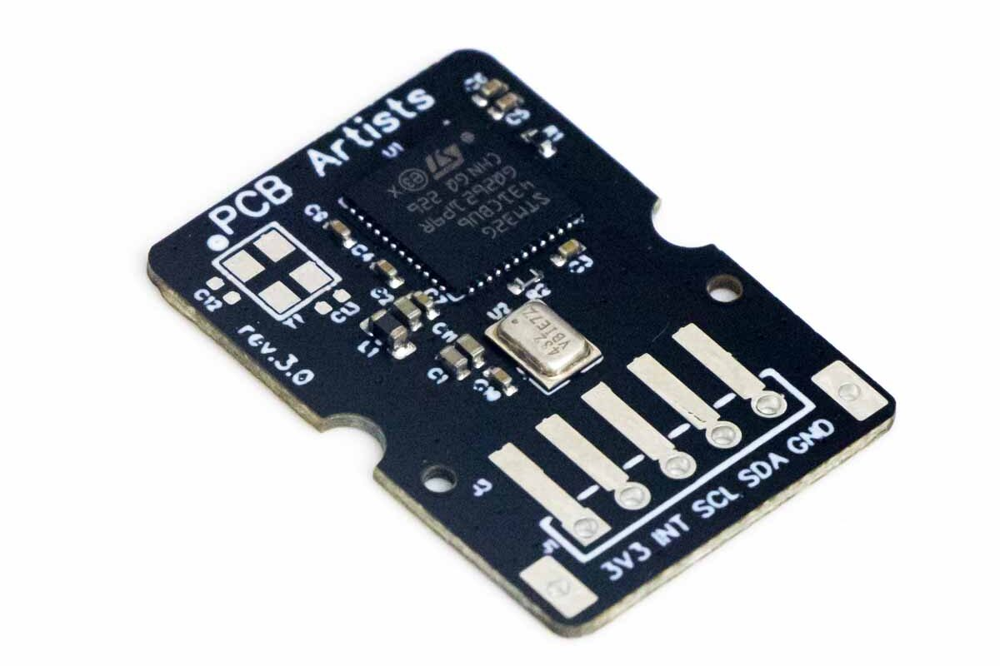

# I2C Decibel Meter Module Interfacing Guide

*Interfacing guide for the
[PCB Artists I2C Decibel Meter Module](https://pcbartists.com/product/i2c-decibel-sound-level-meter-module/).*

## Overview

The PCB Artists decibel meter module is a low power, tiny, and accurate sound
level meter module that reads sound pressure level in dB SPL. You can connect
the sensor to your Arduino, ESP32, Raspberry Pi or similar hardware. This guide
aims to make the task of decibel meter module interfacing easy for you.

## Pinout and Pin Descriptions

The sound level meter module has five pins, four of which must be connected for
operation.

The INT (interrupt) pin is optional and may be left open if unused in your
application.

| Pin | Value | Description | Notes |
| - | - | - | - |
| 1 | 3V3 | Power supply input pin | Source clean 3.3V regulated power supply to this pin. |
| 2 | INT | Open-drain interrupt pin | Active low; If enabled, INT pin goes low when an interrupt is pending. |
| 3 | SCL | Open-drain I2C SCL pin | Standard I2C bus SCL line, recommended pull-up is at least 10K. |
| 4 | SDA | Open-drain I2C SDA pin | Standard I2C bus SDA line, recommended pull-up is at least 10K. |
| 5 | GND | Module ground | Connect directly to the ground of system power source or battery if possible. |

## Module Connector Options

The module can be configured with three types of connectors.

| Connector | Description |
| - | - |
| JST-XH (vertical) | If your application needs to have the decibel sensor module glued to an enclosure where the wires must be secured reliably, this option works best. |
| JST-XH (horizontal) | If your application needs the module to be in an enclosure but has limited room above the module, use this connector configuration. |
| 0.1″ header | This is best suited for prototyping on breadboards and initial evaluation. |

## Interfacing with Raspberry Pi

The standard 40-pin Raspberry Pi GPIO header contains a 3.3V power output,
ground, SCL and SDA. These 4 pins are all you need to use to connect the sound
level meter module to a Raspberry Pi.

Here are details on
[decibel meter module interfacing with Raspberry Pi](accurate-raspberry-pi-decibel-meter.md)
and sample code that you can use to test the sensor.

## Frequently Asked Questions

- [Can I connect the sound sensor module with long wires?](#can-i-connect-the-sound-sensor-module-with-long-wires)
- [How can I get accurate decibel readings with low noise?](#how-can-i-get-accurate-decibel-readings-with-low-noise)
- [Can I power the module separately instead of using the host PCB (Arduino, etc)?](#can-i-power-the-module-separately-instead-of-using-the-host-pcb-arduino-etc)
- [Can I use the decibel sensor with 1.8V systems?](#can-i-use-the-decibel-sensor-with-18v-systems)
- [How can I use multiple sound sensor modules on one I2C bus?](#how-can-i-use-multiple-sound-sensor-modules-on-one-i2c-bus)

### Can I connect the sound sensor module with long wires?

In general, it is recommended to keep the I2C wires **as short as possible**. If
the I2C cable length is longer than 30 cm, use **high quality cables** that are
tied together. Pull-up resistance used should be **4.7K or lower** and I2C clock
speed should be reduced to **less than 10kHz for long wires**.

### How can I get accurate decibel readings with low noise?

The PCB Artists decibel sensor is very immune to noise. However, it can still be
susceptible to external RF interference and coupled mechanical vibrations. Use a
**short, good quality cable** to connect the decibel meter. **Run the cable
close to PCB ground plane** where possible. Mount the module in a way where
vibrations from fans and enclosure cannot directly couple to the sensor.

### Can I power the module separately instead of using the host PCB (Arduino, etc)?

Yes, you can use a dedicated 3.3V power supply for the decibel sensor. Make sure
the **ground connection is common** for the power supply, decibel sensor and
Arduino/host PCB. **Use a star ground topology** and avoid forming loops.

### Can I use the decibel sensor with 1.8V systems?

Yes, you can use 1.8V logic systems with the decibel meter but only if you power
the decibel module using a 1.8V power source.

### How can I use multiple sound sensor modules on one I2C bus?

Yes, you can use multiple decibel sensor modules on one I2C bus by using modules
with different I2C addresses. Contact us after placing an order.

## Change Log

5 May 2023

- Initial release
