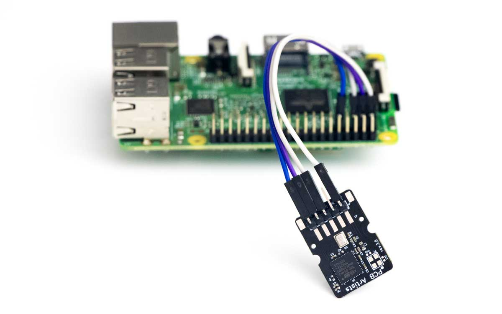

# Programming Manual

_Manaul for programmiing communication with the I2C interface of the Decibel
Meter Module._

## Overview

This decibel meter programming manual contains all the information that you will
need to communicate with the decibel sensor module over I2C interface. All
relevant registers and their bits have been described, along with their default
states on power-up.

If you are new to the PCB Artists sound level module, this programming manual
should be read along with the
[module interfacing reference](interfacing-guide.md).

## Applicable Products

This documentation applies to the following products:

- Decibel sensor with built-in MEMS mic (“regular” and “spectrum analyzer”
  variants) – [Product Link](https://pcbartists.com/product/i2c-decibel-sound-level-meter-module/)

- Decibel sensor with external mic (“regular” and “spectrum analyzer” variants)
  – [Product Link](https://pcbartists.com/product/i2c-decibel-meter-module-ip67-microphone/)

Some registers are not identically implemented on all these variants. In that
case, there is a note accompanying the register description.

## Decibel Meter Programming Basics

The I2C decibel meter uses an I2C interface for communication with a host. No
particular initialization sequence is necessary and the module powers up with a
commonly used combination of settings:

- A-weighting, suitable for general measurement
- 1000 ms averaging duration (“slow mode” on commercial sound meters)
- Interrupt function disabled
- Decibel history registers are updated every averaging duration (1000 ms) and
  min/max count is tracked

These settings can be changed and some other advanced settings can be configured
using the I2C registers listed in this programming guide.

## I2C Interface and Communication

### Communicating with the Decibel Meter Module

The PCB Artists sound level meter is ready for communication over I2C **within
5 ms of power-up**. The host can communicate with the module by accessing the
7-bit **device I2C address (`0x48` by default, unless you ordered a custom
module)**.

The host can then **read the DECIBEL register any time** for reading the latest
sound intensity level in decibels (dB SPL). The decibel value usually takes
about 1 second to stabilize after power-up.

Naming convention used for this section to describe I2C operations are:

**DEV_ADDR** – I2C device address
**REG_ADDR** – Device register address to read from or write to
**R/W** Read/write bit in the I2C device address frame
**ACK** – Acknowledge condition on the I2C bus
**NACK** – No-acknowledge condition on the I2C bus
**START** – Start condition on the I2C bus
**STOP** – Stop condition on the I2C bus
**RESTART** – Re-start or (stop + start) condition on the I2C bus

> [!TIP]
> To verify that I2C communication works, you can use the SCRATCH register to perform a write-read-verify sequence.

#### I2C Single Byte Write Sequence

- Generate a START condition
- Send DEV_ADDR with R/W bit set to ‘0’ (write)
- Send REG_ADDR
- Send the data byte to be written at REG_ADDR
- Generate a STOP condition

#### I2C Single Byte Read Sequence

- Generate a START condition
- Send DEV_ADDR with R/W bit set to ‘0’ (write)
- Send REG_ADDR
- Generate a RESTART condition
- Send DEV_ADDR with R/W bit set to ‘1’ (read)
- Read data from REG_ADDR
- Generate a STOP condition

#### I2C Multi-Byte Write Sequence

- Generate a START condition
- Send DEV_ADDR with R/W bit set to ‘0’ (write)
- Send REG_ADDR
- Send consecutive data bytes to be written starting at REG_ADDR
- Generate a STOP condition

#### I2C Multi-Byte Read Sequence

- Generate a START condition
- Send DEV_ADDR with R/W bit set to ‘0’ (write)
- Send REG_ADDR
- Generate a RESTART condition
- Send DEV_ADDR with R/W bit set to ‘1’ (read)
- Read consecutive data bytes starting at REG_ADDR
- Generate a STOP condition

#### I2C Decibel Meter Module Register Map

The PCB Artists decibel meter contains the following registers. The host should
not try to read from or write to undocumented locations as they are reserved for
diagnostics and calibration.
<section>
  

    

      

        

          <h2>VERSION register (0x00)</h2>
        

      

      

        

          

            <table style="width: 100%; border-collapse: collapse; border-style: solid;" border="2 px">
              <tbody>
                <tr>
                  <td style="width: 33.3333%; text-align: center;">
                    <strong>ADDRESS</strong>
                  </td>
                  <td style="width: 33.3333%; text-align: center;">
                    <strong>DEFAULT VALUE</strong>
                  </td>
                  <td style="width: 33.3333%; text-align: center;">
                    <strong>TYPE</strong>
                  </td>
                </tr>
                <tr>
                  <td style="width: 33.3333%; text-align: center;">0x00</td>
                  <td style="width: 33.3333%; text-align: center;">See Notes</td>
                  <td style="width: 33.3333%; text-align: center;">R/O</td>
                </tr>
              </tbody>
            </table>
          

        

      

      

        

          
<strong>DESCRIPTION</strong>

          <ul>
            <li><strong>BIT [7:4] – HW Version</strong> Hardware version</li>
            <li><strong>BIT [3:0] – FW Version</strong> Firmware version</li>
          </ul>
        

      

    

  

</section>
<section>
  

    

      

        

          

            <h2>ID3-ID0 registers (0x01-0x04)</h2>
          

        

        

          

            

              <table style="width: 100%; border-collapse: collapse; border-style: solid;" border="2 px">
                <tbody>
                  <tr>
                    <td style="width: 33.3333%; text-align: center;"><strong>ADDRESS</strong></td>
                    <td style="width: 33.3333%; text-align: center;"><strong>DEFAULT VALUE</strong></td>
                    <td style="width: 33.3333%; text-align: center;"><strong>TYPE</strong></td>
                  </tr>
                  <tr>
                    <td style="width: 33.3333%; text-align: center;">0x01 – 0x04</td>
                    <td style="width: 33.3333%; text-align: center;">unique ID</td>
                    <td style="width: 33.3333%; text-align: center;">R/O</td>
                  </tr>
                </tbody>
              </table>
            

          

        

        

          

            
<strong>DESCRIPTION</strong>

            <ul>
              <li><strong>BIT [31:0] – Device ID </strong>32-bit unique device ID (4 bytes)</li>
            </ul>
          

        

      

    

  

</section>
<section>
  

    

      

        

          

            <h2 id="scratch-register-0x05">SCRATCH register (0x05)</h2>
          

        

        

          

            

              <table style="width: 100%; border-collapse: collapse; border-style: solid;" border="2 px">
                <tbody>
                  <tr>
                    <td style="width: 33.3333%; text-align: center;"><strong>ADDRESS</strong></td>
                    <td style="width: 33.3333%; text-align: center;"><strong>DEFAULT VALUE</strong></td>
                    <td style="width: 33.3333%; text-align: center;"><strong>TYPE</strong></td>
                  </tr>
                  <tr>
                    <td style="width: 33.3333%; text-align: center;">0x05</td>
                    <td style="width: 33.3333%; text-align: center;">0xAA</td>
                    <td style="width: 33.3333%; text-align: center;">R/W</td>
                  </tr>
                </tbody>
              </table>
            

          

        

        

          

            
<strong>DESCRIPTION</strong>

            <ul>
              <li><strong>BIT [7:0] – Scratch</strong> Scratchpad register, host may write and read any value from this register at any time. Writing and reading back values from this register may be useful for I2C testing.</li>
            </ul>
          

        

      

    

  

</section>
<section>
  

    

      

        

          

            <h2 id="control-register-0x06">CONTROL register (0x06)</h2>
          

        

        

          

            

              <table style="width: 100%; border-collapse: collapse; border-style: solid;" border="2 px">
                <tbody>
                  <tr>
                    <td style="width: 33.3333%; text-align: center;"><strong>ADDRESS</strong></td>
                    <td style="width: 33.3333%; text-align: center;"><strong>DEFAULT VALUE</strong></td>
                    <td style="width: 33.3333%; text-align: center;"><strong>TYPE</strong></td>
                  </tr>
                  <tr>
                    <td style="width: 33.3333%; text-align: center;">0x06</td>
                    <td style="width: 33.3333%; text-align: center;">0x02</td>
                    <td style="width: 33.3333%; text-align: center;">R/W</td>
                  </tr>
                </tbody>
              </table>
            

          

        

        

          

            
<strong>DESCRIPTION</strong>

            <ul>
              <li><b>BIT [7:6] – Reserved</b> Do not write 1 to these bits</li>
              <li><b>BIT [6] – Enable Line Output (only available on module with external microphone) </b>Set to enable line output. Line output is derived directly from the microphone and a gain is applied (as set in GAIN register at 0x0F).</li>
              <li><b>BIT [4] – Interrupt Type</b> Set to enable minimum/maximum level interrupts. – If 1, THR_MIN and THR_MAX registers are used as threshold values. When a decibel reading falls outside the range set by THR_MIN and THR_MAX, interrupt pin is activated. – If 0, INT pin goes low when 90 of the 100 DB_HISTORY registers are filled with readings.</li>
              <li><strong>BIT [3] – Interrupt Enable</strong> Set to enable the interrupt pin operation. INT pin goes low to indicate a pending interrupt. A pending interrupt must be cleared by writing to the RESET register.</li>
              <li><strong>BIT [2:1] – Filter Selection</strong> <strong>00</strong> – None <strong>01</strong> – A-weighting (default) <strong>10</strong> – C- weighting <strong>11</strong> – Reserved</li>
              <li><strong>BIT [0] – Power Down</strong> Set this bit to power down the decibel sensor. Writing a 0 does nothing. <b>NOTE:</b> To power up the module, the host must set bit [3] of RESET register to cause a module reset. Failing to do so can put the module in an unknown state. After wake-up and reset, the module settings are restored to their power-up default state and application can use the module as usual.</li>
            </ul>
          

        

      

    

  

</section>
<section>
  

    

      

        

          

            <h2 id="tavg-high-byte-register-0x07">TAVG high byte register (0x07)</h2>
          

        

        

          

            

              <table style="width: 100%; border-collapse: collapse; border-style: solid;" border="2 px">
                <tbody>
                  <tr>
                    <td style="width: 33.3333%; text-align: center;"><strong>ADDRESS</strong></td>
                    <td style="width: 33.3333%; text-align: center;"><strong>DEFAULT VALUE</strong></td>
                    <td style="width: 33.3333%; text-align: center;"><strong>TYPE</strong></td>
                  </tr>
                  <tr>
                    <td style="width: 33.3333%; text-align: center;">0x07</td>
                    <td style="width: 33.3333%; text-align: center;">0x03</td>
                    <td style="width: 33.3333%; text-align: center;">R/W</td>
                  </tr>
                </tbody>
              </table>
            

          

        

        

          

            
<strong>DESCRIPTION</strong>

            <ul>
              <li><strong>BIT [7:0] – Tavg_high </strong>Averaging time (high byte) in milliseconds for calculating sound intensity levels. Set [Tavg_high:Tavg_low] = 1,000 for slow mode intensity measurement. Set [Tavg_high:Tavg_low] = 125 for fast mode intensity measurement.</li>
            </ul>
          

        

      

    

  

</section>
<section>
  

    

      

        

          

            <h2 id="tavg-low-byte-register-0x08">TAVG low byte register (0x08)</h2>
          

        

        

          

            

              <table style="width: 100%; border-collapse: collapse; border-style: solid;" border="2 px">
                <tbody>
                  <tr>
                    <td style="width: 33.3333%; text-align: center;"><strong>ADDRESS</strong></td>
                    <td style="width: 33.3333%; text-align: center;"><strong>DEFAULT VALUE</strong></td>
                    <td style="width: 33.3333%; text-align: center;"><strong>TYPE</strong></td>
                  </tr>
                  <tr>
                    <td style="width: 33.3333%; text-align: center;">0x08</td>
                    <td style="width: 33.3333%; text-align: center;">0xE8</td>
                    <td style="width: 33.3333%; text-align: center;">R/W</td>
                  </tr>
                </tbody>
              </table>
            

          

        

        

          

            
<strong>DESCRIPTION</strong>

            <ul>
              <li><strong>BIT </strong><strong>[7:0] – </strong><strong>Tavg_low </strong>Averaging time (low byte) in milliseconds for calculating sound intensity levels. Set [Tavg_high:Tavg_low] = 1,000 for slow mode intensity measurement. Set [Tavg_high:Tavg_low] = 125 for fast mode intensity measurement. <b>NOTE: </b>Writing to Tavg_low causes the combined value of Tavg_high:Tavg_low to take effect. Therefore, Tavg_high must be written first.</li>
            </ul>
          

        

      

    

  

</section>
<section>
  

    

      

        

          

            <h2 id="reset-register-0x09">RESET register (0x09)</h2>
          

        

        

          

            

              <table style="width: 100%; border-collapse: collapse; border-style: solid;" border="2 px">
                <tbody>
                  <tr>
                    <td style="width: 33.3333%; text-align: center;"><strong>ADDRESS</strong></td>
                    <td style="width: 33.3333%; text-align: center;"><strong>DEFAULT VALUE</strong></td>
                    <td style="width: 33.3333%; text-align: center;"><strong>TYPE</strong></td>
                  </tr>
                  <tr>
                    <td style="width: 33.3333%; text-align: center;">0x09</td>
                    <td style="width: 33.3333%; text-align: center;">0x00</td>
                    <td style="width: 33.3333%; text-align: center;">W/O</td>
                  </tr>
                </tbody>
              </table>
            

          

        

        

          

            
<strong>DESCRIPTION</strong>

            <ul>
              <li><strong>BIT [7:4] – Reserved </strong></li>
              <li><strong>BIT [3] – System Reset </strong>Set this bit to perform a soft system reset and restore settings to defaults. This bit is automatically cleared.<strong> NOTE: </strong>This bit must be set to wake up the device from sleep mode.<strong> </strong></li>
              <li><strong>BIT [2] – Clear History </strong>Set this bit to clear the most recent 100 decibel values stored in history registers. This bit is self-clearing.<strong> </strong></li>
              <li><strong>BIT [1] – Clear MIN/MAX </strong>Set this bit to clear the maximum and minimum dB values stored in MAX and MIN registers. This bit is self-clearing.<strong> </strong></li>
              <li><strong>BIT [0] – Clear Interrupt </strong>Set this bit to clear interrupt signal and set INT pin to high-Z. This bit is self-clearing.</li>
            </ul>
          

        

      

    

  

</section>
<section>
  

    

      

        

          

            <h2 id="decibel-register-0x0a">DECIBEL register (0x0A)</h2>
          

        

        

          

            

              <table style="width: 100%; border-collapse: collapse; border-style: solid;" border="2 px">
                <tbody>
                  <tr>
                    <td style="width: 33.3333%; text-align: center;"><strong>ADDRESS</strong></td>
                    <td style="width: 33.3333%; text-align: center;"><strong>DEFAULT VALUE</strong></td>
                    <td style="width: 33.3333%; text-align: center;"><strong>TYPE</strong></td>
                  </tr>
                  <tr>
                    <td style="width: 33.3333%; text-align: center;">0x0A</td>
                    <td style="width: 33.3333%; text-align: center;">0x00</td>
                    <td style="width: 33.3333%; text-align: center;">R/O</td>
                  </tr>
                </tbody>
              </table>
            

          

        

        

          

            
<strong>DESCRIPTION</strong>

            <ul>
              <li><strong>BIT [7:0] – Decibel</strong> Latest sound intensity value in decibels, averaged over the last Tavg time period. The decibel reading is only valid after about 1 second of module power-up.</li>
            </ul>
          

        

      

    

  

</section>
<section>
  

    

      

        

          

            <h2 id="min-register-0x0b">MIN register (0x0B)</h2>
          

        

        

          

            

              <table style="width: 100%; border-collapse: collapse; border-style: solid;" border="2 px">
                <tbody>
                  <tr>
                    <td style="width: 33.3333%; text-align: center;"><strong>ADDRESS</strong></td>
                    <td style="width: 33.3333%; text-align: center;"><strong>DEFAULT VALUE</strong></td>
                    <td style="width: 33.3333%; text-align: center;"><strong>TYPE</strong></td>
                  </tr>
                  <tr>
                    <td style="width: 33.3333%; text-align: center;">0x0B</td>
                    <td style="width: 33.3333%; text-align: center;">undefined</td>
                    <td style="width: 33.3333%; text-align: center;">R/O</td>
                  </tr>
                </tbody>
              </table>
            

          

        

        

          

            
<strong>DESCRIPTION</strong>

            <ul>
              <li><strong>BIT [7:0] – Minimum Reading</strong> Minimum value of decibel reading captured since power-up or manual reset of MIN/MAX registers.</li>
            </ul>
          

        

      

    

  

</section>
<section>
  

    

      

        

          

            <h2 id="max-register-0x0c">MAX register (0x0C)</h2>
          

        

        

          

            

              <table style="width: 100%; border-collapse: collapse; border-style: solid;" border="2 px">
                <tbody>
                  <tr>
                    <td style="width: 33.3333%; text-align: center;"><strong>ADDRESS</strong></td>
                    <td style="width: 33.3333%; text-align: center;"><strong>DEFAULT VALUE</strong></td>
                    <td style="width: 33.3333%; text-align: center;"><strong>TYPE</strong></td>
                  </tr>
                  <tr>
                    <td style="width: 33.3333%; text-align: center;">0x0C</td>
                    <td style="width: 33.3333%; text-align: center;">undefined</td>
                    <td style="width: 33.3333%; text-align: center;">R/O</td>
                  </tr>
                </tbody>
              </table>
            

          

        

        

          

            
<strong>DESCRIPTION</strong>

            <ul>
              <li><strong>BIT [7:0] – Maximum Reading</strong> Maximum value of decibel reading captured since power-up or manual reset of MIN/MAX registers.</li>
            </ul>
          

        

      

    

  

</section>
<section>
  

    

      

        

          

            <h2 id="thr-min-register-0x0d">THR_MIN register (0x0D)</h2>
          

        

        

          

            

              <table style="width: 100%; border-collapse: collapse; border-style: solid;" border="2 px">
                <tbody>
                  <tr>
                    <td style="width: 33.3333%; text-align: center;"><strong>ADDRESS</strong></td>
                    <td style="width: 33.3333%; text-align: center;"><strong>DEFAULT VALUE</strong></td>
                    <td style="width: 33.3333%; text-align: center;"><strong>TYPE</strong></td>
                  </tr>
                  <tr>
                    <td style="width: 33.3333%; text-align: center;">0x0D</td>
                    <td style="width: 33.3333%; text-align: center;">45</td>
                    <td style="width: 33.3333%; text-align: center;">R/W</td>
                  </tr>
                </tbody>
              </table>
            

          

        

        

          

            
<strong>DESCRIPTION</strong>

            <ul>
              <li><strong>BIT [7:0] – Lower Threshold</strong> Minimum decibel value (threshold) under which interrupt should be asserted.</li>
            </ul>
          

        

      

    

  

</section>
<section>
  

    

      

        

          

            <h2 id="thr-max-register-0x0e">THR_MAX register (0x0E)</h2>
          

        

        

          

            

              <table style="width: 100%; border-collapse: collapse; border-style: solid;" border="2 px">
                <tbody>
                  <tr>
                    <td style="width: 33.3333%; text-align: center;"><strong>ADDRESS</strong></td>
                    <td style="width: 33.3333%; text-align: center;"><strong>DEFAULT VALUE</strong></td>
                    <td style="width: 33.3333%; text-align: center;"><strong>TYPE</strong></td>
                  </tr>
                  <tr>
                    <td style="width: 33.3333%; text-align: center;">0x0E</td>
                    <td style="width: 33.3333%; text-align: center;">85</td>
                    <td style="width: 33.3333%; text-align: center;">R/W</td>
                  </tr>
                </tbody>
              </table>
            

          

        

        

          

            
<strong>DESCRIPTION</strong>

            <ul>
              <li><strong>BIT [7:0] – Upper Threshold</strong> Maximum decibel value (threshold) above which interrupt should be asserted.</li>
            </ul>
          

        

      

    

  

</section>
<section>
  

    

      

        

          

            <h2 id="gain-register-0x0f">GAIN register (0x0F)</h2>
          

        

        

          

            

              <table style="width: 100%; border-collapse: collapse; border-style: solid;" border="2 px">
                <tbody>
                  <tr>
                    <td style="width: 33.3333%; text-align: center;"><strong>ADDRESS</strong></td>
                    <td style="width: 33.3333%; text-align: center;"><strong>DEFAULT VALUE</strong></td>
                    <td style="width: 33.3333%; text-align: center;"><strong>TYPE</strong></td>
                  </tr>
                  <tr>
                    <td style="width: 33.3333%; text-align: center;">0x0F</td>
                    <td style="width: 33.3333%; text-align: center;">18</td>
                    <td style="width: 33.3333%; text-align: center;">R/W</td>
                  </tr>
                </tbody>
              </table>
            

          

        

        

          

            
<strong>DESCRIPTION</strong>

            <ul>
              <li><strong>GAIN [7:0] – Microphone analog gain adjustment (only available on module with external mic)</strong> Write to this register to apply analog gain to the attached electret microphone. This value only needs to be modified if you are using your own microphone. The default value will work with the default microphone supplied with the module.  Acceptable values are 0 to 95 to set the gain in 0.5 dB steps (+0.0 dB to +47.5 dB).</li>
            </ul>
          

        

      

    

  

</section>
<section>
  

    

      

        

          

            <h2 id="dbhistory-0-to-dbhistory-99-0x14-to-0x77">DBHISTORY_0 to DBHISTORY_99 (0x14 to 0x77)</h2>
          

        

        

          

            

              <table style="width: 100%; border-collapse: collapse; border-style: solid;" border="2 px">
                <tbody>
                  <tr>
                    <td style="width: 33.3333%; text-align: center;"><strong>ADDRESS</strong></td>
                    <td style="width: 33.3333%; text-align: center;"><strong>DEFAULT VALUE</strong></td>
                    <td style="width: 33.3333%; text-align: center;"><strong>TYPE</strong></td>
                  </tr>
                  <tr>
                    <td style="width: 33.3333%; text-align: center;">0x14 to 0x77</td>
                    <td style="width: 33.3333%; text-align: center;">0x00</td>
                    <td style="width: 33.3333%; text-align: center;">R/O</td>
                  </tr>
                </tbody>
              </table>
            

          

        

        

          

            
<strong>DESCRIPTION</strong>

            <ul>
              <li><strong>BIT [7:0] – History </strong>Past decibel values arranged in a queue, captured every “Tavg” milliseconds. DBHISTORY_0 contains the latest value and DBHISTORY_99 contains the oldest value available. When the queue is full, the oldest value at DBHISTORY_99 is deleted to insert new value at DBHISTORY_00.</li>
            </ul>
          

        

      

    

  

</section>
<section>
  

    

      

        

          

            <h2 id="freq-64bins-0-to-freq-64bins-63-0x78-to-0xb7">FREQ_64BINS_0 to FREQ_64BINS_63 (0x78 to 0xB7)</h2>
          

        

        

          

            

              <table style="width: 100%; border-collapse: collapse; border-style: solid;" border="2 px">
                <tbody>
                  <tr>
                    <td style="width: 33.3333%; text-align: center;"><strong>ADDRESS</strong></td>
                    <td style="width: 33.3333%; text-align: center;"><strong>DEFAULT VALUE</strong></td>
                    <td style="width: 33.3333%; text-align: center;"><strong>TYPE</strong></td>
                  </tr>
                  <tr>
                    <td style="width: 33.3333%; text-align: center;">0x78 to 0xB7</td>
                    <td style="width: 33.3333%; text-align: center;">undefined</td>
                    <td style="width: 33.3333%; text-align: center;">R/O</td>
                  </tr>
                </tbody>
              </table>
            

          

        

        

          

            
<strong>DESCRIPTION</strong>

            <ul>
              <li><strong>BIT [7:0] – Frequency Component Values in dB SPL </strong>Frequency components of the signal represented as 64 bands (8 kHz total band width). The number represents the magnitude of the frequency component in dB SPL. No weighting filters are applied to frequency data. Exponential time averaging period is determined by “Tavg” value. <strong>NOTE: This feature is only available in Spectrum Analyzer version of the module (VERSION = 0x32)</strong></li>
            </ul>
          

        

      

    

  

</section>

## Firmware Version Notes

Several versions of the decibel sound level meter module are available for
purchase. Here are some notes on the hardware/firmware versions available.

### VERSION = 0x31 (MEMS mic version, long term support and available for sale)

[Sensor module with Hardware v3](https://pcbartists.com/product/i2c-decibel-sound-level-meter-module/) +
Firmware v1 is currently available for sale on our store and will be supported
for long term use. It contains a MEMS microphone and is easy to mount on an
enclosure with a double sided tape. Any future firmware updates will retain
backward compatibility with firmware v1.

**Hardware v3 + Firmware v1 notes:**

- All registers and functions documented above are implemented

- Changing weight settings takes at least one Tavg period to take effect. Host
  should clear min/max and history records.

### VERSION = 0x32 (version 0x31 features + audio spectrum analyzer)

[Sensor module with Hardware v3](https://pcbartists.com/product/i2c-decibel-sound-level-meter-module/) +
Firmware v2 is currently available for sale on our store and supports audio
spectrum analysis in addition to all the features listed for version = 0x31.
Firmware version = 0x32 is backward compatible with firmware version = 0x31.

**Hardware v3 + Firmware v2 notes:**

- Rolling average implementation for the frequency bins is not a real rolling
average implementation. Instead, it uses a modified version of exponential
moving average with low pass filtering to provide jitter-free averaging
performance.

- Frequency bin registers from 0x78 to 0xC7 are only implemented on this version
of the module.

### VERSION = 0x81 (external mic version, long term support and available for sale)

[Sensor module with Hardware v3](https://pcbartists.com/product/i2c-decibel-sound-level-meter-module/) +
Firmware v1 is currently available for sale on our store and will be supported
for long term use. It connects to an external electret microphone. Firmware
version = 0x81 is backward compatible with firmware version = 0x31.

**Hardware v3 + Firmware v1 notes:**

- The decibel reading is exponentially time averaged over the set averaging time
  period (TAVG) setting.

- If you are migrating from the module with built-in MEMS microphone to the
  module with electret microphone, you do not need to make any firmware changes.
  All important I2C registers are backwards compatible.

## Change Log

27 March 2024

- Added register description and notes for variant with external IP67 electret
  microphone

11 January 2024

- Added FREQ BIN registers for spectrum analyzer version of the module

11 October 2023

- Added VERSION = 0x32 and audio spectrum analysis feature documentation

13 May 2023

- Update descriptions of Control and Reset registers
- Change behavior of Int Type and Power Down bits in Control register

6 May 2023

- Initial release
